!!! Warning "文档建设中……"
    当前的课程文档与代码仍在建设中，欢迎您通过GitHub提出建议与贡献。

## 准备软件

我使用了virtualbox以及xubuntu的系统镜像进行Ubuntu22.04的虚拟机安装。

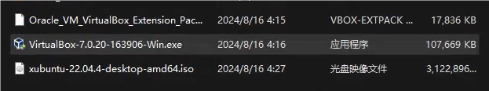

## 安装virtualbox

一路默认即可，以管理员身份运行。

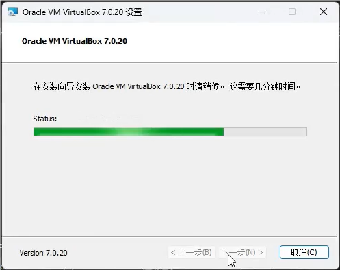

等待一段时间。

## 安装XUbuntu

### 新建虚拟机

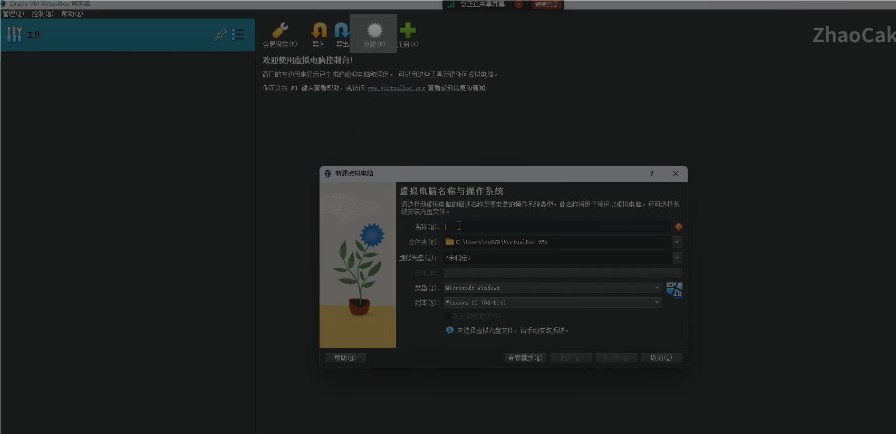

如上图选择新建，新建虚拟电脑；名字随意，选择你的虚拟光盘，注意勾选跳过自动安装，否则自动安装的用户不具备管理员权限，需要另外设置。

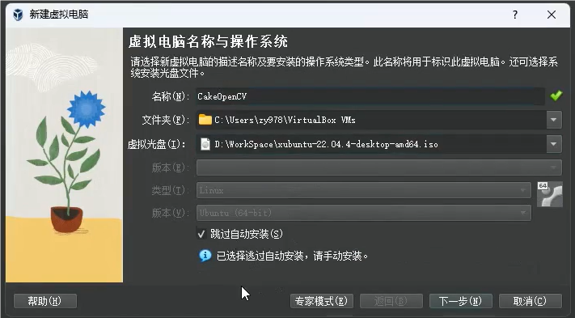

根据实际情况选择你的内存大小和cpu线程数。其中是否启用EFI选项，我们选择不启用，原因下一步再说。

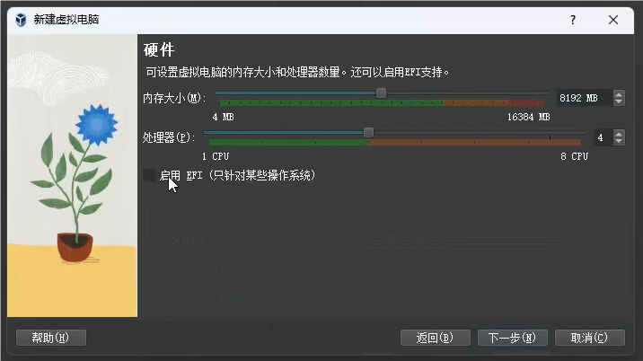

这里磁盘空间30个G其实就完全够用了，对于一台只学习OpenCV的虚拟机来说。其中不勾选预先分配全部空间。就笔者个人体会而言，选择勾选EFI与预先分配全部场景的情况应该是在制作一个可以移动并做成移动系统的虚拟磁盘的情况下。考虑到EFI的作用，如果是在一个虚拟磁盘装多个系统的情况应该也需要勾选EFI。常规来说不勾选EFI启动会更快。

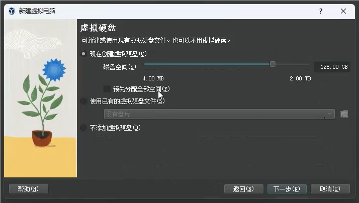

### 启动虚拟机

创建完成，点击上方启动。

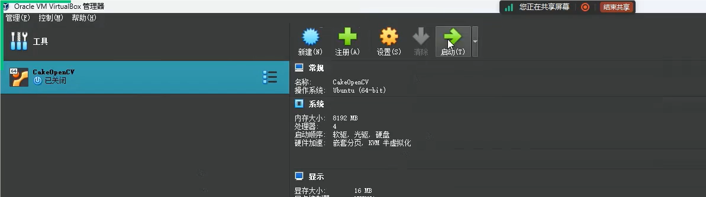

会进入安装镜像的安装导引界面，选择install Xubuntu。

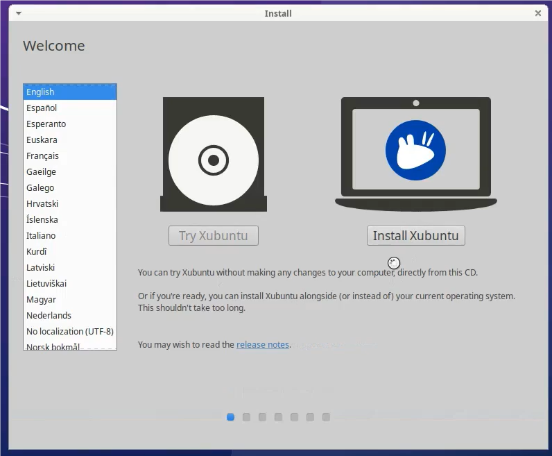

键盘布局选择英文布局即可。

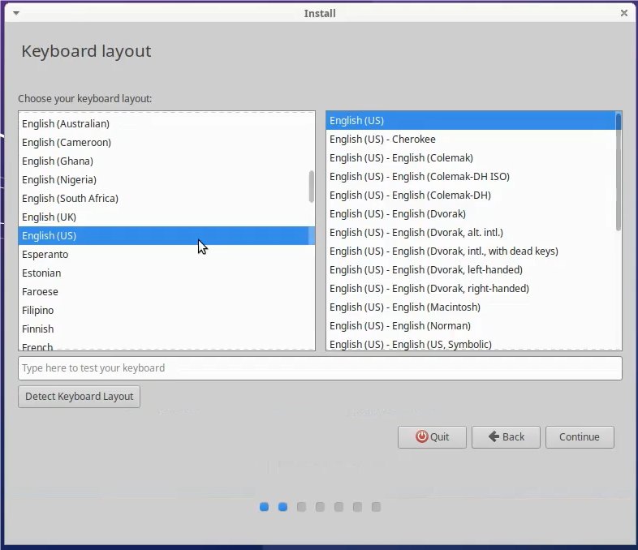

正常安装与最小化安装，由于这是预置了清华镜像源的Ubuntu镜像，因此选择正常安装并不会由于安装了很多软件造成安装缓慢；也可以勾选上“下载软件包更新”，如果是官方的安装镜像，由于没有使用国内镜像源，网速比较慢，建议先不勾选，进入系统更换软件源后再更新软件包。

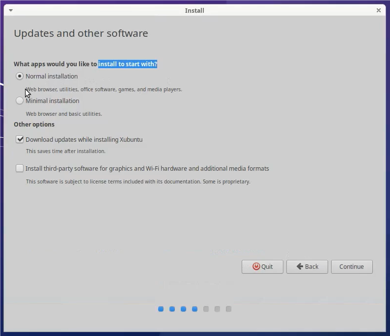

因为我们是虚拟机安装，所以这里选择擦除磁盘并且由系统自动分区即可。如果是真机安装双系统，则需要选择`something else`手动分区避免损害原系统。

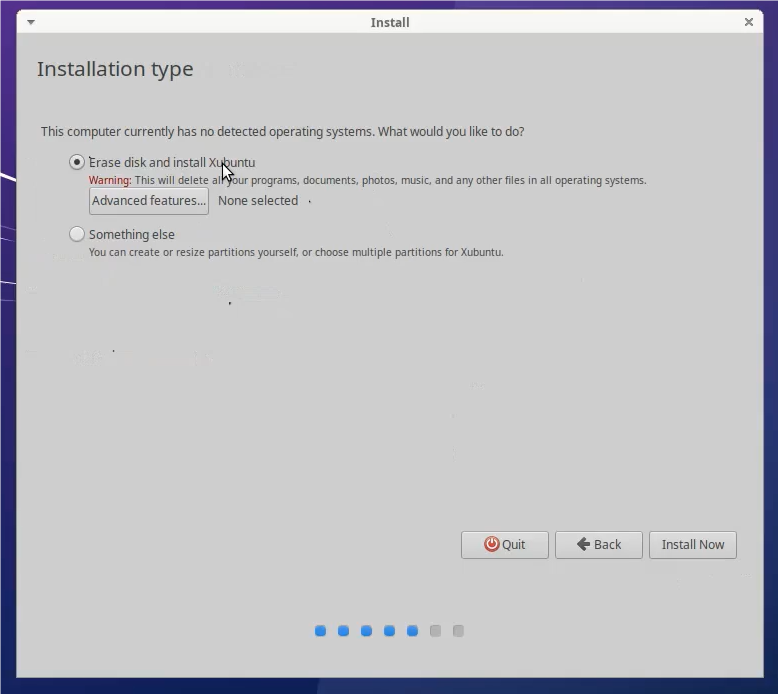

接下来时区选择上海。

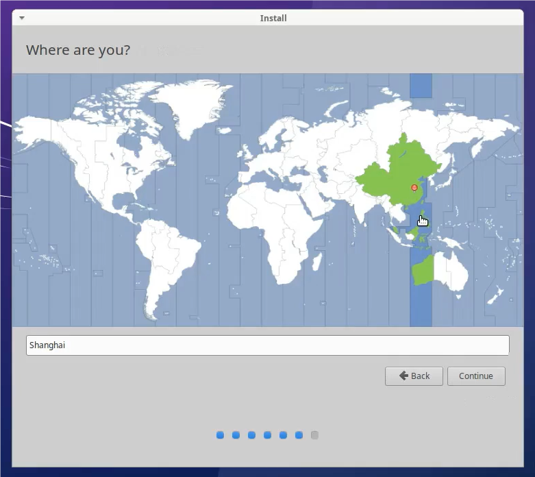

设置PC名称和用户名以及密码，不要使用中文（其实也使用不了）。名字不合法会提示的。密码可以简短，会认为密码过短，但不会拒绝密码。

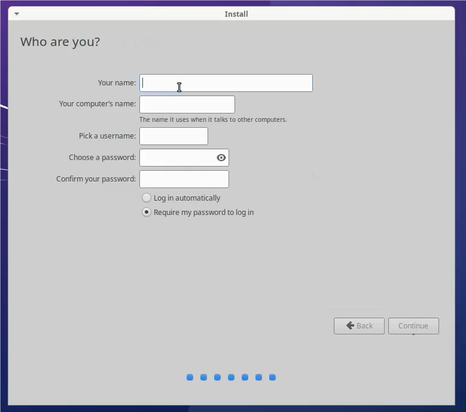

接下来，等待等待再等待，心儿已等碎。

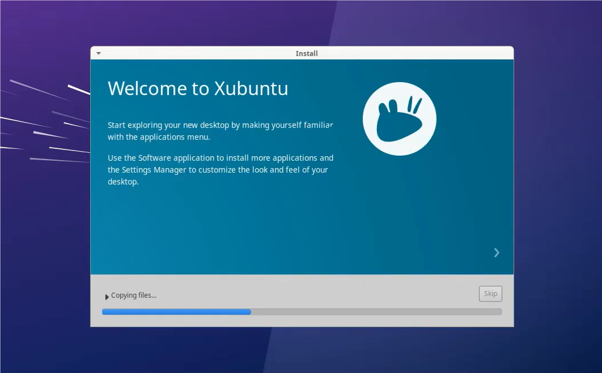

## 使用XUbuntu

安装完成之后会提示重启，如果是真机安装需要在它提示拔出U盘并按Enter之后操作；对于Virtualbox虚拟机软件，在完成安装并重启之后会自动取消镜像的挂载。

启动了Xubuntu。

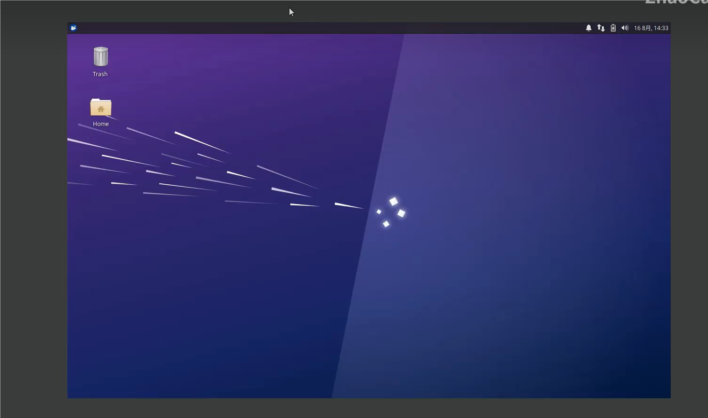

### 启动终端

使用`Crtl+Alt+T`快捷键启动终端。

*详细的命令建议阅读Linux101或其他介绍Linux的文档*

### 更换软件源

通过系统自带的浏览器（右上角菜单可以找到）打开`https://mirrors.tuna.tsinghua.edu.cn/`，通过搜索框搜索Ubuntu，点击后面的“问号（help）”打开软件源帮助。按照上面的内容操作即可。

注意更换镜像源版本到22.04 jammy。可以使用vim进行编辑或者其他在系统中存在的文本编辑器。

### vim的基本使用

对于刚刚接触vim的人，只需要知道五个命令/符号就可以使用vim了。

- `i`：insert，能够进入正常的输入模式
- `:`：打开vim命令行，允许输入命令
- `w`：保存。在终端底部的行使用
- `q`：quit，退出。扩展一个`!`，可以使用`:q!`强制退出修改了但不打算保存的文件。
- `ESC`：退出模式，但不是退出vim，而是退出insert、visual等模式。在使用`hjkl`移动光标之前都需要使用这个键退出输入模式。

